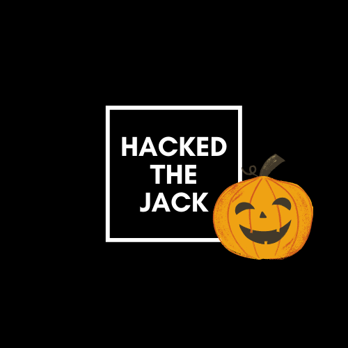
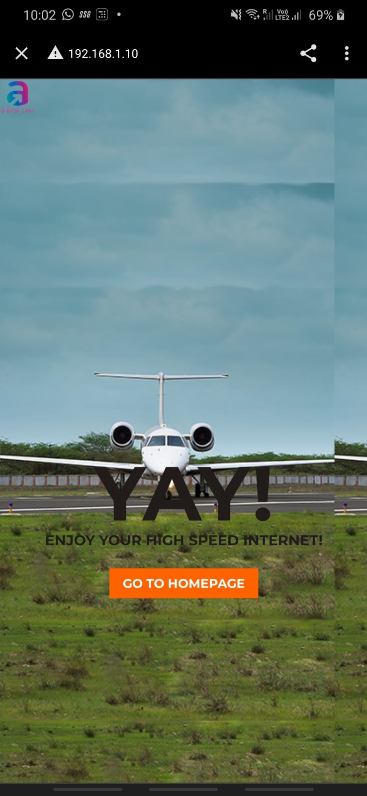
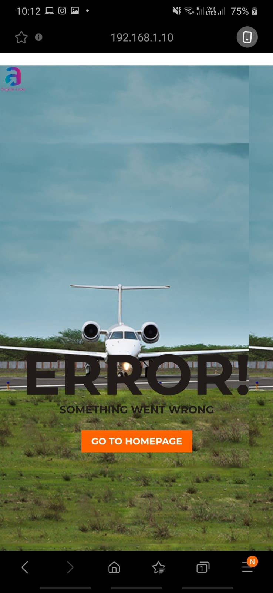

<span style="display:block;text-align:center">

[![Made With][made-with-shield]][made-with-url]
[![Contributors][contributors-shield]][contributors-url]
[![Forks][forks-shield]][forks-url]
[![Stargazers][stars-shield]][stars-url]
[![Issues][issues-shield]][issues-url]
[![MIT License][license-shield]][license-url]

</span>

<!-- PROJECT LOGO -->
<br />
<p align="center">
  <a href="https://github.com/kanitmann/JackTheHack">
    
  </a>

  <h3 align="center">Gizmo - Airport Assistant </h3>

  <p align="center">
    *To be Updated*
    <br />
    <a href="https://github.com/kanitmann/JackTheHack"><strong>Explore the docs »</strong></a>
    <br />
    <br />
    <a href="https://github.com/kanitmann/JackTheHack">View Demo</a>
    ·
    <a href="https://github.com/kanitmann/JackTheHack/issues">Report Bug</a>
    ·
    <a href="https://github.com/kanitmann/JackTheHack/issues">Request Feature</a>
  </p>
</p>

<!-- TABLE OF CONTENTS -->
<details open="open">
  <summary><h2 style="display: inline-block">Table of Contents</h2></summary>
  <ol>
    <li>
      <a href="#about-the-project">About The Project</a>
      <ul>
        <li><a href="#built-with">Built With</a></li>
      </ul>
    </li>
    <li>
      <a href="#getting-started">Getting Started</a>
      <ul>
        <li><a href="#prerequisites">Prerequisites</a></li>
        <li><a href="#installation">Installation</a></li>
      </ul>
    </li>
    <li><a href="#usage">Usage</a></li>
    <li><a href="#roadmap">Roadmap</a></li>
    <li><a href="#license">License</a></li>
    <li><a href="#acknowledgements">Meet the Team</a></li>
  </ol>
</details>

<!-- ABOUT THE PROJECT -->

## About The Project

<p>

**Problem 1:**

Airport wifis can be tedious to log in and manage, and a lot of people just turn to mobile data to save all the hassle.

**Proposed Solution:**

Gizmo is supposed to be an "Adani Airport Assistant" web app, which can scan automatically log in to Airport Wifi for you. All you need to do is to scan a QR code on your ticket (which will contain your information and Wifi Connection keys).

**Problem 2:**

Large Airports can be a hassle to navigate for shops, food points, lounges, basic facilities, etc. 

**Proposed Solution:**

All shops are mapped on Gizmo and users can be navigated to desired stores with the shortest route possible (with A* algorithm). Precise user location is determined using GPS and WiFi positioning.
</p>


### Built With

- [Python](https://www.python.org/)
- [PHP](https://www.php.net/)
- [HTML5 + CSS3]()

<!-- GETTING STARTED -->

## Getting Started

To get a local copy up and running follow these simple steps.

### Prerequisites

This list things you need to use the web app and how to install them.

- Python 3.6.8
- PHP

### Installation

1. Clone the repo
   ```sh
   git clone https://github.com/kanitmann/JackTheHack.git
   ```

<!-- USAGE EXAMPLES 

## Usage

Use this space to show useful examples of how a project can be used. Additional screenshots, code examples and demos work well in this space. You may also link to more resources.

_For more examples, please refer to the [Documentation](https://example.com)_

 ROADMAP -->
## Screenshots

1. QR Code Generated on Ticket


2. Connection Successful Page



3. Connection Error



## Roadmap

See the [open issues](https://github.com/kanitmann/JackTheHack/issues) for a list of proposed features (and known issues).

<!-- LICENSE -->

## License

Distributed under the GNU GPL3 License. See `LICENSE` for more information.

<!-- ACKNOWLEDGEMENTS -->

## Meet the Team

- [Kanit Mann](https://github.com/kanitmann) :wolf:
- [Vinayak Dubey](https://github.com/viny1ic) :koala:
- [Vishikh Raj](https://github.com/dungeon-master27) :bear:

> Made with 💙 by Kanit Mann

<!-- MARKDOWN LINKS & IMAGES -->
<!-- https://www.markdownguide.org/basic-syntax/#reference-style-links -->

[contributors-shield]: https://img.shields.io/github/contributors/kanitmann/JackTheHack.svg?style=for-the-badge
[contributors-url]: https://github.com/kanitmann/JackTheHack/graphs/contributors
[forks-shield]: https://img.shields.io/github/forks/kanitmann/JackTheHack.svg?style=for-the-badge
[forks-url]: https://github.com/kanitmann/JackTheHack/network/members
[stars-shield]: https://img.shields.io/github/stars/kanitmann/JackTheHack.svg?style=for-the-badge
[stars-url]: https://github.com/kanitmann/JackTheHack/stargazers
[issues-shield]: https://img.shields.io/github/issues/kanitmann/JackTheHack.svg?style=for-the-badge
[issues-url]: https://github.com/kanitmann/JackTheHack/issues
[license-shield]: https://img.shields.io/github/license/kanitmann/JackTheHack?style=for-the-badge&logo=appveyor
[license-url]: https://github.com/kanitmann/JackTheHack/blob/master/LICENSE.txt
[made-with-shield]: https://img.shields.io/github/languages/top/kanitmann/JackTheHack?style=for-the-badge
[made-with-url]: https://shields.io/github/languages/top/kanitmann/JackTheHack.svg?style-for-the-badge
[product-screenshot]: (images/screenshot.png)
